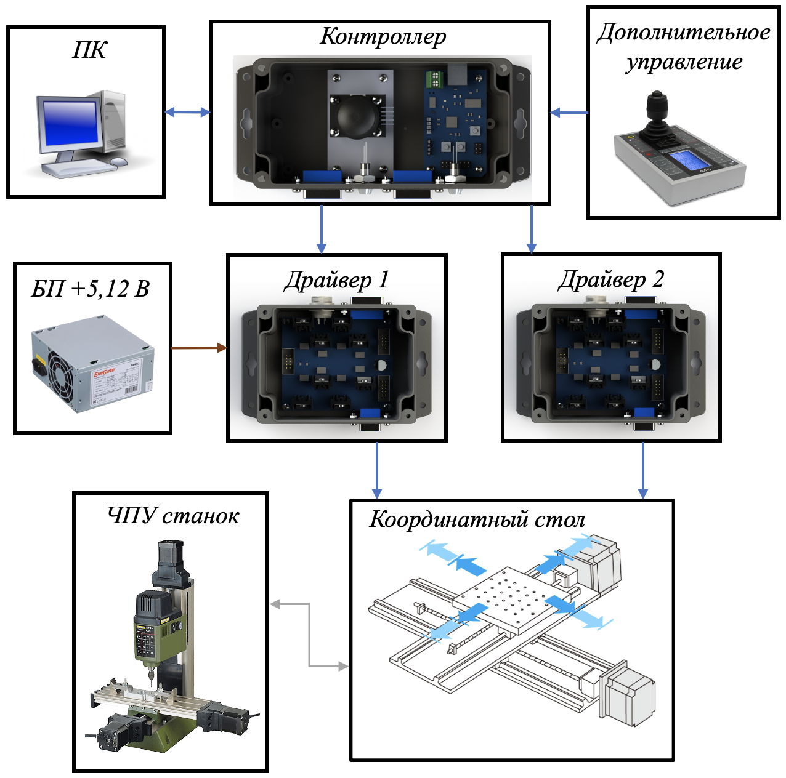
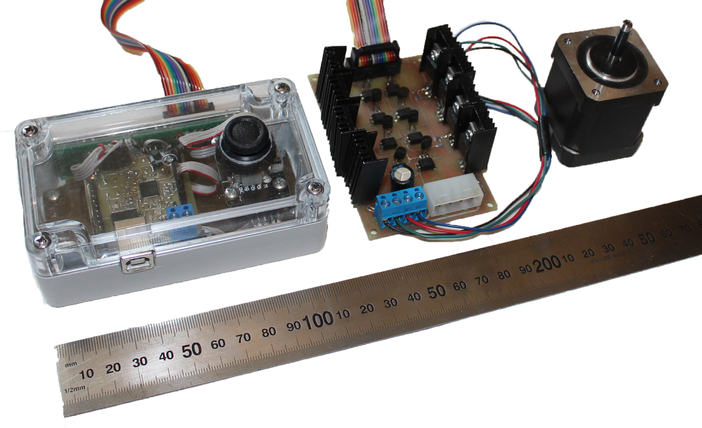
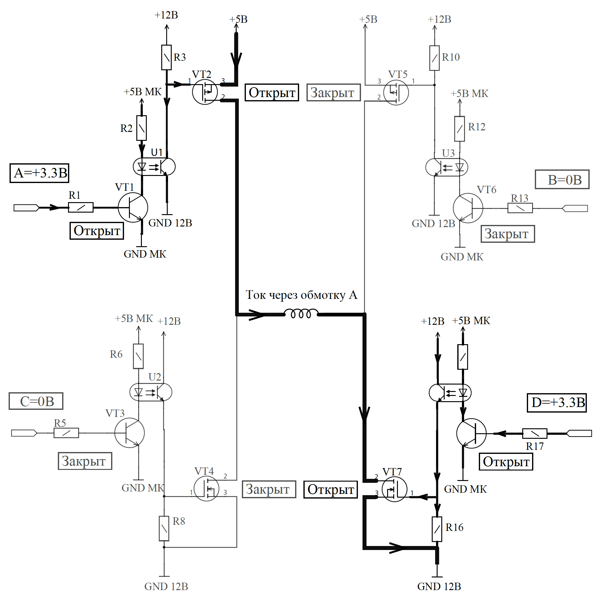
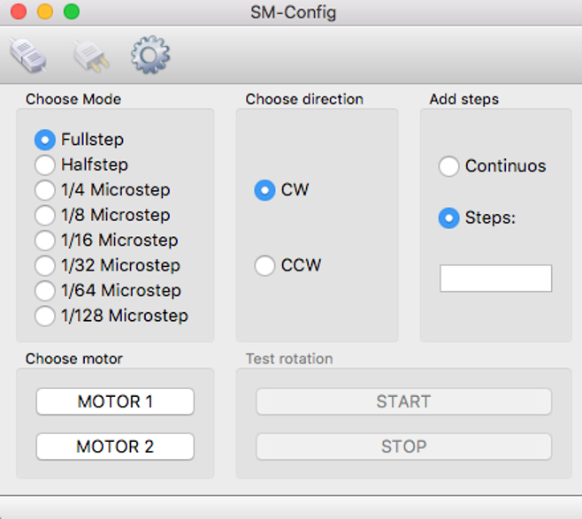

###### THIS PROJECT IS MADE FOR EDUCATIONAL PURPOSES ONLY

Source code and hardware description for stepper motor controlling system. This repo is a part of my final university project in 2018 and contains sources for STM32F051 MCU firmware, sources for configuration utillity and technical documents. The goal was to achieve smallest micro-step movement of stepper motor using PWM signals from MCU and H-Bridges on MOSFET transistors. 

Hardware part consists of two PCBs: controller with MCU and driver with MOSFETs. Controller boards allows connecting two drivers for controlling two stepper motors. This example scheme shows how to connect 2-axis device to the system and control it with joystick or with external device via UART interface:

Prototype of my system on photo below.

Microstepping is achieved by applying PWM signal to the coils. This scheme shows how the current flows through the coil of stepper motor conneted to driver H-Bridge:

control-utility is a simle tool for testing the system. It allows to choose between two steppers, setup their directions and microstep modes. After connecting to controller board with USB cable, setup mode and add steps. After pressing START button, motor start moving and makes the amount of steps configured. If "Continuous" mode chosen, motor will work till STOP button pressed.

For all questions demianzenkov@gmail.com.

